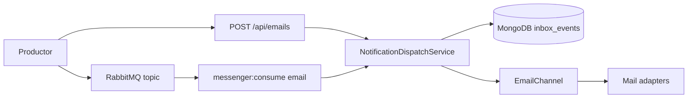
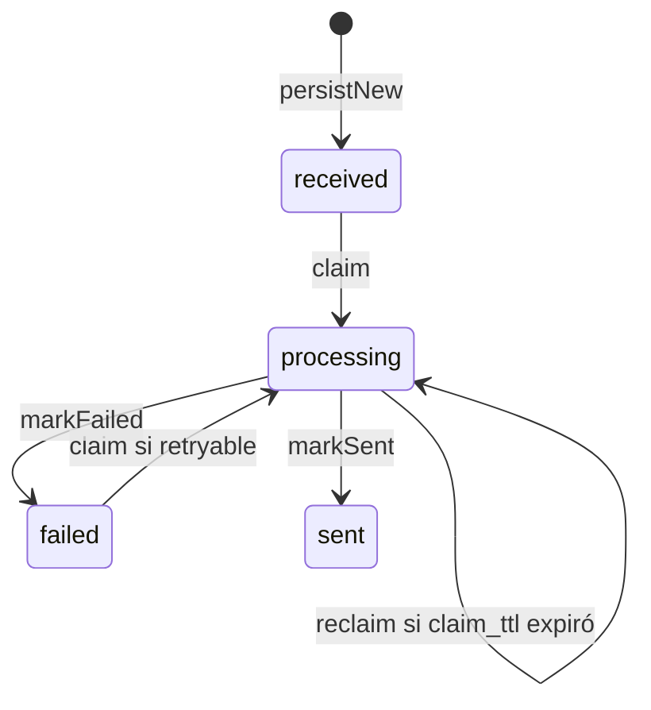
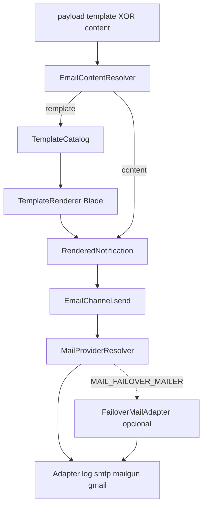

# Arquitectura

Microservicio Laravel 13 (PHP 8.3) para enviar notificaciones. **v1 envía solo email.** Push y SMS tienen contrato JSON, colas RabbitMQ e inbox en MongoDB; no hay workers ni envío real de esos canales.

El productor describe *qué* enviar. Este servicio decide *con qué proveedor*. El contrato de uso (payloads y API) está en el [README](../README.md). Las decisiones de diseño están en [design.md](design.md). El mapa de clases está en [components.md](components.md).

## Vista general

Hay **dos entradas y un núcleo**. HTTP y RabbitMQ convergen en `NotificationDispatchService`, que persiste el evento en el inbox, reclama el envío y delega al canal.

Infra local: MongoDB 7 y RabbitMQ 3 (`docker compose up -d`). La app PHP no corre en Compose.

## Dos entradas, un núcleo

### HTTP (síncrono)

Rutas en [`routes/api.php`](../routes/api.php), prefijo `/api`.

1. `AuthenticateApiKey` valida el header `X-API-Key` (salvo `GET /health`).
2. `POST /emails` → [`EmailController::store`](../app/Http/Controllers/EmailController.php) → [`StoreEmailRequest::toMessage()`](../app/Http/Requests/StoreEmailRequest.php).
3. Si no viene `event_id`, se genera un UUID. Se eliminan `payload.provider` y `payload.from`.
4. [`NotificationDispatchService::dispatch`](../app/Services/NotificationDispatchService.php) corre **en el mismo request** y responde `202` con el estado del inbox.

No se publica a RabbitMQ desde la API. El bus es el camino de otros microservicios.

### RabbitMQ (asíncrono)

1. El productor publica JSON al exchange topic (`MESSENGER_EXCHANGE`, en `.env.example`: `notificaciones`).
2. `php artisan messenger:consume email` arranca el worker ([`MessengerConsumeCommand`](../app/Console/Commands/MessengerConsumeCommand.php)).
3. [`MessengerFactory`](../app/Messenger/MessengerFactory.php) declara topología, deserializa con [`JsonMessageSerializer`](../app/Messenger/JsonMessageSerializer.php) y enruta al handler.
4. `SendEmailMessageHandler` llama al mismo `NotificationDispatchService::dispatch`.

El serializer es JSON interoperable (no el formato PHP de Symfony). Si el `event_type` es desconocido o el envelope es inválido, el mensaje se convierte en `UnsupportedNotificationMessage` (fallo permanente).

## Inbox (MongoDB)

Colección `inbox_events`, modelo [`InboxEvent`](../app/Models/InboxEvent.php), acceso vía [`InboxEventRepository`](../app/Repositories/InboxEventRepository.php).

Índices (`php artisan inbox:ensure-indexes`):

- único en `event_id`
- único sparse en `(channel, idempotency_key)` — la misma clave puede usarse en email y SMS

### Ciclo de vida

| Estado | Rol |
|--------|-----|
| `received` | Recién persistido o reintento manual |
| `processing` | Claim atómico (`findOneAndUpdate`); incrementa `attempts` |
| `sent` | Terminal de éxito |
| `failed` | Error; `retryable` true/false |
| `skipped_duplicate` | Terminal; existe en el enum pero el dispatch de producción no lo asigna |

`NotificationDispatchService::dispatch`:

1. `persistNew` → `received`. Si hay clave duplicada (E11000), recarga el documento existente.
2. Si el estado es terminal (`sent` / `skipped_duplicate`), o es un duplicado `failed` no retryable, **sale sin enviar**.
3. `claim` atómico. Si otro worker tiene el claim vigente, devuelve el evento en vuelo.
4. Si `attempts > notifications.max_send_attempts` (default 5), marca `failed` permanente.
5. Resuelve el canal. Si `supported()` es false, `failed` permanente.
6. Si no hay contenido renderizado, `channel->render()` y `storeRendered()`.
7. `channel->send()` → `markSent`. Permanente → `markFailed(..., retryable: false)`. Cualquier otro `Throwable` → `markFailed(..., retryable: true)` **y relanza** (Messenger reintenta).

Claim reclaimable si: `received`; o `failed` + `retryable`; o `processing` con `claimed_at` más viejo que `notifications.claim_ttl_seconds` (default 300). El `worker_id` es `hostname:pid`.

Reintento manual: `POST /api/emails/{eventId}/retry` resetea a `received` y vuelve a `dispatch`. Solo email, solo si no está `sent`.

## Messenger

Configuración en [`config/messenger.php`](../config/messenger.php).

El nombre del exchange lo define `MESSENGER_EXCHANGE`. En `.env.example` vale `notificaciones`. Si la variable no está, el fallback de config es `notifications`.

| Canal | Routing key | Cola | DLQ | Worker v1 |
|-------|-------------|------|-----|-----------|
| email | `email.send` | `email.send` | `email.send.dlq` | sí (`consume: true`) |
| push | `push.send` | `push.send` | `push.send.dlq` | no (cola declarada) |
| sms | `sms.send` | `sms.send` | `sms.send.dlq` | no (cola declarada) |

Retry del worker: `MultiplierRetryStrategy` (`MESSENGER_MAX_RETRIES`, delay, multiplier, max delay). Tras agotar reintentos, el mensaje va a la DLQ. Excepciones `UnrecoverableExceptionInterface` (permanentes) no entran en ese ciclo.

`messenger:setup` declara exchange, colas y bindings. `messenger:consume push|sms` falla a propósito: *"no se consume en v1"*.

## Pipeline email

- **Render:** [`EmailChannel::render`](../app/Channels/Email/EmailChannel.php) → [`EmailContentResolver`](../app/Channels/Email/EmailContentResolver.php). Exactamente uno de `template` o `content`. Plantilla: [`TemplateCatalog`](../app/Channels/Email/TemplateCatalog.php) + vistas `resources/views/notifications/email/{nombre}/v{n}.blade.php`. Sin `version` se usa `latest` de [`config/notification_templates.php`](../config/notification_templates.php). La versión y el `from` resueltos se persisten en el inbox.
- **Send:** construye `RenderedEmail` (destinatarios del payload + `from` del catálogo / identidades) y llama a [`MailProviderResolver`](../app/Channels/Email/MailProviderResolver.php).

| `MAIL_MAILER` | Adapter |
|---------------|---------|
| `smtp`, `sendmail` | `SmtpMailAdapter` |
| `mailgun` | `MailgunMailAdapter` |
| `gmail` | `GmailMailAdapter` (API, service account) |
| `log`, `array` | `LogMailAdapter` |

Si `MAIL_FAILOVER_MAILER` está definido y es distinto del primario, se envuelve en `FailoverMailAdapter`.

## Auth, API y operaciones

Auth: header `X-API-Key` frente a `NOTIFICATIONS_API_KEY`. `GET /api/health` no exige clave; comprueba app, MongoDB y RabbitMQ (`ok` 200 / `degraded` 503).

Rutas protegidas: `POST /emails`, `GET /notifications/{eventId}`, `POST /emails/{eventId}/retry`, `GET /templates`. No hay `POST /api/push` ni `POST /api/sms` en v1.

Comandos:

| Comando | Rol |
|---------|-----|
| `inbox:ensure-indexes` | Índices únicos del inbox |
| `messenger:setup` | Exchange, colas, DLQs |
| `messenger:consume email` | Worker de email |

## Límites v1

[`ChannelRegistry`](../app/Channels/ChannelRegistry.php) registra email, push y SMS. [`PushChannel`](../app/Channels/Push/PushChannel.php) y [`SmsChannel`](../app/Channels/Sms/SmsChannel.php) tienen `supported() = false`; render/send lanzan `ChannelNotEnabledException`. El dispatch marca esos eventos como `failed` permanente. Las colas existen para que los productores puedan publicar ya; el worker las rechaza.
